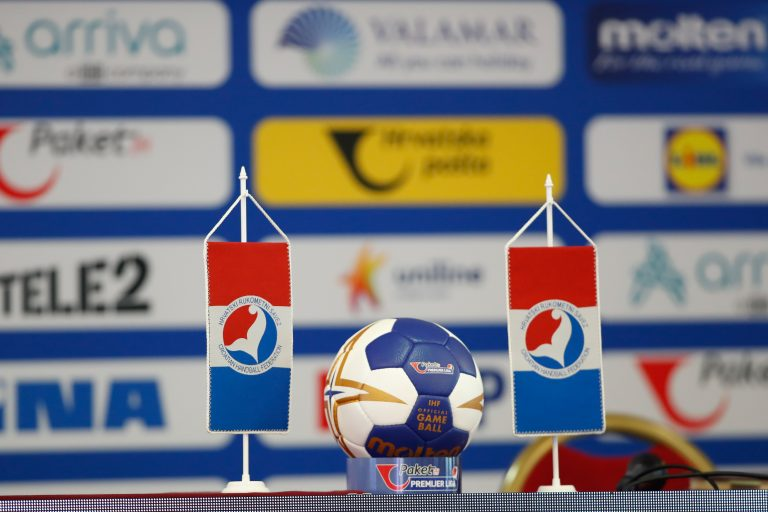

Dugoočekivana sjednica Upravnog odbora Hrvatskog rukometnog saveza (HRS-a) održana je 25. kolovoza 2020. godine, u Zagrebu. Tom prigodom rečeno je kako je korona kriza (COVID – 19) iz temelja uzdrmala cijeli svijet pa tako i sport, a osobito rukomet. Nakon gotovo šest mjeseci bez natjecanja, nova sezona je pred vratima.

Hrvatski rukometni savez nije ni jednog trenutka mirovao tijekom tog prisilnog prekida. Dapače, pripremio je i osmislio brojne novosti koje ćemo ugraditi u sezonu koja je pred nama – od digitalizacije cijelog Saveza i sustava, sređivanja baze podataka kompletne rukometne obitelji, do promjena u sastavu liga i sustavima natjecanja kod mlađih dobnih uzrasta.

Iz dugačkog dnevnog reda i rasprave Upravnog odbora, izdvajamo najvažnije odluke:

Prijelazni rok za natjecateljsku sezonu 2020./21. traje od 01. srpnja 2020. godine do 28. veljače 2021. godine.
Upravni odbor usvojio je kalendar natjecanja za sezonu 2020./21.
Donešene su odluke o početku hrvatskih rukometnih liga za sezonu 2020./21.:
Prva ženska rukometna liga počinje s natjecanjem 26./27. rujna, baš kao i Druge hrvatske ženske lige Sjever i Zapad. Druga hrvatska ženska rukometna liga Jug kreće 03./04. listopada 2020.
Paket 24 Premijer liga, Prve muške rukometne lige Sjever i Jug te Druga liga Sjever počinju s natjecanjem 26./27. rujna.
Druge muške lige Istok, Zapad i Jug počinju svoja natjecanja 03./04. listopada.
Odlukom Upravnog odbora ukinuti su Propisnik o statusu rukometaša, Registracijski propisnik, Postupovni propisnik Registracijskog povjerenstva te Propisnik o ustroju natjecanja, a donešena je odluka o usvajanju Propisnika o ustroju natjecanja te Propisnika o registraciji osoba i klubova te statusu igračica/igrača.
Upravni odbor imenovao je odvjetnika iz Zagreba Ivana Čuića za arbitražnog suca HRS-a.
Upravi odbor imenovao je odvjetnika iz Zagreba Srećka Ilića za stegovnog suca HRS-a.
Upravni odbor donio je odluku o propozicijama natjecanja za natjecateljsku sezonu 2020./2021., popunjavanju seniorskih liga te odluku o sustavu natjecanja mlađih dobnih uzrasta.
Upravni odbor donio je odluku o Povjereniku/voditelju natjecanja za natjecateljsku sezonu 2020./21. Za Paket 24 Premijer ligu, Prvu hrvatsku žensku ligu, Prve lige (M) te sve Druge lige povjerenik je Ante Ančić.
Upravni odbor imenovao je Komisiju za provedbu epidemioloških mjera koju čine: dr. Tamara Poljičan, dr. Dario Rahelić, dipl. sant.ing. Robert Kober, mag. med. Cecilija Rotim, dr.sc. Damir Trut i mag. Romeo Vrečko.
Upravni odbor utvrdio je liste sudaca i nadzornika suđenja u natjecateljskoj sezoni 2020./21.
Upravni odbor imenovao je Povjerenstvo za delegiranje sudaca u natjecateljskoj sezoni 2020./21., koje čine Josip Posavec, Ante Ančić i Tomislav Lukić. Također je imenovan povjerenik za delegiranje delegata. Tu će dužnost obavljati Ante Ančić.
Upravni odbor prihvatio je prijedlog organizacije Svjetskog prvenstva za kadetkinje koje će se održati od 07. – 20. prosinca ove godine u Poreču, odnosno prijedlog organizacije Europskog juniorskog prvenstva koje će se održati od 07. – 17. siječnja 2021. godine u Poreču.
